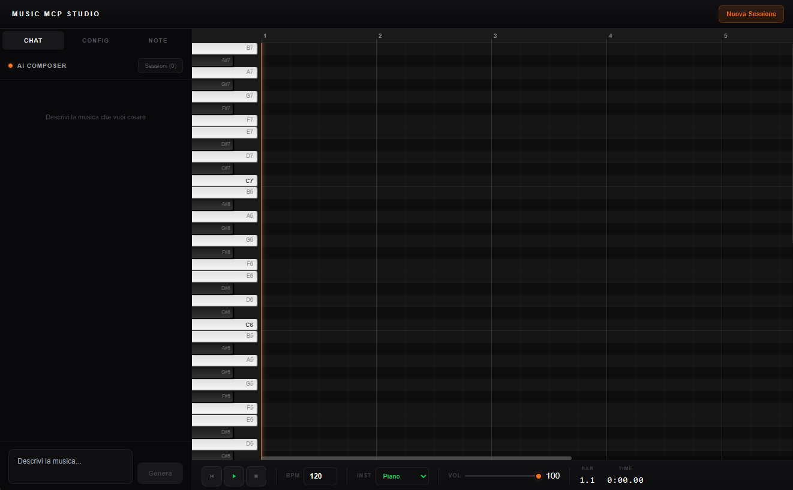

# OpenMusic

<p align="center">
  
</p>

OpenMusic is a professional-grade platform for Algorithmic Music Generation, designed to bridge the gap between high-level artistic intention and deterministic musical execution. With a premium DAW aesthetic, it leverages LLMs for creative direction while enforcing strict musical rules through Python composition algorithms.

## Key Features

- **Hybrid Generation Architecture**: 
  - **LLM Orchestrator**: Translates user prompts into artistic intentions (mood, style, energy, emotional arc).
  - **Deterministic Python Engine**: Generates every note, duration, and velocity using musical mathematics. Zero flat LLM MIDI data.
- **Hans Zimmer Scoring Techniques**: Implements professional cinematic scoring methods:
    - **Ostinato Layers**: Driving rhythmic pulses for tension.
    - **Pedal Tones**: Grounded bass drones with sub-octave doubling.
    - **Emotional Arcs**: Dynamic velocity and register shifts through the composition sections.
- **Pro Audio Engine**: High-quality synthesis using Tone.js with integrated low-pass filters, compressors, and limiters.
- **Export Capabilities**: Seamlessly export compositions to high-fidelity WAV format (44.1kHz, Float32).
- **Studio Interface**: Minimalist, dark-mode design with interactive Piano Roll, real-time Transport controls, and session history management.

## Interface

<p align="center">
  
</p>

## Technology Stack

- **Frontend**: Next.js (App Router), TypeScript, Tone.js for audio.
- **Backend**: FastAPI, Pydantic for data schemas.
- **AI**: LLM-driven intention mapping for artistic variety.
- **Mathematics**: NumPy-based contour generation for melodic movement.

## Quick Start

### 1. Prerequisites
- Python 3.10+
- Node.js 18+
- pip or uv

### 2. Backend Setup
```bash
cd backend
python -m venv .venv
# On Windows: .venv\Scripts\activate
# On Linux/macOS: source .venv/bin/activate
pip install -r requirements.txt
uvicorn music_mcp.api_server:app --port 8001
```

### 3. Frontend Setup
```bash
cd frontend
npm install
npm run dev
```

The application will be available at http://localhost:3000.

## Project Structure

- `backend/`: Python server with musical generation logic.
- `frontend/`: Next.js application with DAW-style UI and Tone.js playback.
- `docs/`: Architectural documentation and specifications.

---

<p align="center">
  Developed for the future of algorithmic music.
</p>
